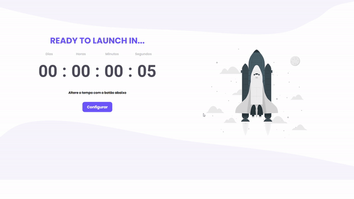

<h1 align="center">
    Rocket Launcher 🚀
</h1>


<div align="center">
   <a href="https://github.com/JohnPetros">
      
   </a>
   
   <a href="https://github.com/JohnPetros/rocket-launcher/commits/main">
      
   </a>
  </a>
   </a>
   <a href="https://github.com/JohnPetros/rocket-launcher/blob/main/LICENSE.md">
      
   </a>
    
</div>

<br>

## 🖥️ Projeto

Projeto de **rocket-launcher customizável**, ou seja, permite o usuário definir o tempo de uma contagem regressiva. Quando temporizador chega a zero, o foguete presente na página é lançado para o céu. Esse projeto foi inspirado em um desafio do Discover, que é um programa promovido pela **@Rocketseat** voltado para o ensino de programação web para iniciantes.

### ⏹️ Demonstração


<div align="center">
    
</div>

---

## ✨ Funcionalidades

- [x] Contagem regressiva de dias, horas, minutos e segundos
- [x] O usuário pode redefinir o temporizador quando quiser e para o tempo que desejar
- [x] O usuário pode recomeçar contagem caso ela tenha acabado
- [x] O intervalo de redefinição de cada unidade de tempo pode ser feita em 1x, 5x ou 10x
- [x] O tempo do temporizador é armazenado constantemente no local storage do navegador, permitindo, no caso do usuário recarregar a página, a contagem continuar de onde parou

---

## Tecnologias

Esse projeto foi desenvolvido com as seguintes tecnologias:

✔️ **[JavaScript](https://developer.mozilla.org/pt-BR/docs/Web/JavaScript)**

✔️ **[CSS](https://developer.mozilla.org/pt-BR/docs/Web/CSS)**

✔️ **[HTML](https://developer.mozilla.org/pt-BR/docs/Web/HTML)**

---

## 🚀 Como rodar este projeto

### Pré-requesitos

Embora não seja obrigatório, para rodar a aplicação de uma forma mais prática, é bom ter o editor de código [VSCode](https://code.visualstudio.com/) junto com a extensão [Live Server](https://marketplace.visualstudio.com/items?itemName=ritwickdey.LiveServer), que pode ser instalada no marketplace do próprio VSCode.

#### 📟 Rodando a aplicação

```bash

# Clone este repositório no terminal/cmd
$ git clone https://github.com/JohnPetros/rocket-launcher.git

# Acesse a pasta do projeto
$ cd rocket-launcher

# Abra a pasta no VSCode
$ code .

# Execute o arquivo index com a extensão Live Server, clicando com o botão direito sobre ele e depois em Open with Live Server

```

---

## ⚙️ Deploy

O deploy desse projeto foi realizado através do **[Github Pages](https://pages.github.com/)**. Isso implica que você pode acessar o projeto funcionando acessando esse **[link](johnpetros.github.io/rocket-launcher/)**

---

## 🎨 Layout:

No link abaixo você encontra o layout do desafio original feito pela equipe da Rocketseat. Lembrando que você precisa ter uma conta no [Figma](http://figma.com/) para acessá-lo.

- [Layout](https://www.figma.com/file/f8etB9sLR00CjZEsBQPDTX/DD-%2F-rocket-launcher-(Copy)?node-id=0%3A1&t=UWlddMnD)

---

## 📝 Licença

Esse projeto está sob a licença MIT. Veja o arquivo [LICENSE](LICENSE) para mais detalhes.

---

<p align="center">
   Feito com 💜 by John Petros 👋🏻
</p>
